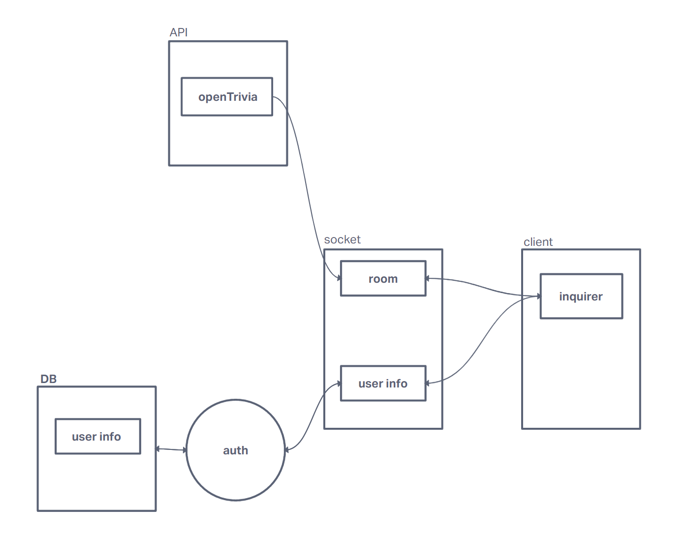

# Software Requirements

## Vision

  Our vision is to create a game utilizing mulitple tools we have learned in our 401 class to provide an interactive multiplayer game in the command line with inquirer. Whether you are on a lunch break or are craving some trivia, we provide you will a game of trivia with unlimited questions coming from the trivia db. Our product will provide you a bug-free, clean game of trivia for anyone to enjoy.
  
## Scope
  
    In:
      - this product will allow you to create a user and change your username.
      - this product will allow you to store user scores.
      - this product will allow you to enter rooms to compete with other users.
      - this product will allow you to select multiple choice answers.
      
    Out: 
    
      - Our product will not have a Front End.

## MVP

  A backend server that will work as a proper game of trivia. Add in a level of Authorization/Authentication as well as a database to store user information, possibly save user scores. Questions will be grabbed from trivia db and presented as multiple choice options through inquirer.
  
  Stretch Goals:

    - Timer functionality.
    - Tournament Mode.
    - Score multiplier.
    - Store user statistics, life-time running score tracker (ex: 90% correct).

## Functional Requirements

   1. A user can create a user and update their username.
   2. Our game of trivia should run cleanly.
   3. Based on user answers, it should properly calculate user scores.

### Data Flow

- User will have to create a user or sign in
- User will have to run a node index and start game of trivia. This will trigger our inquirer prompt and display questions to user.
- User will have to input an answer. This will trigger our .then answers and display the correct answer to the user to see if what they answered was correct.
- Scores will be calculated ('unsure how right now, a count++ i assume)
- We will either inplement a timer or stop the game on command or stop the game once a certain amount of questions have been proposed.
- Final scores will be returned to user.

## Non-Functional Requirements

  1. Auth
  2. Testing

## Domain Modeling

## Schema Diagram

 {
  username: ,
  password: ,
  role: basic/pro,
  score: ,
  rounds played: ,
  accuracy: ,
 }
